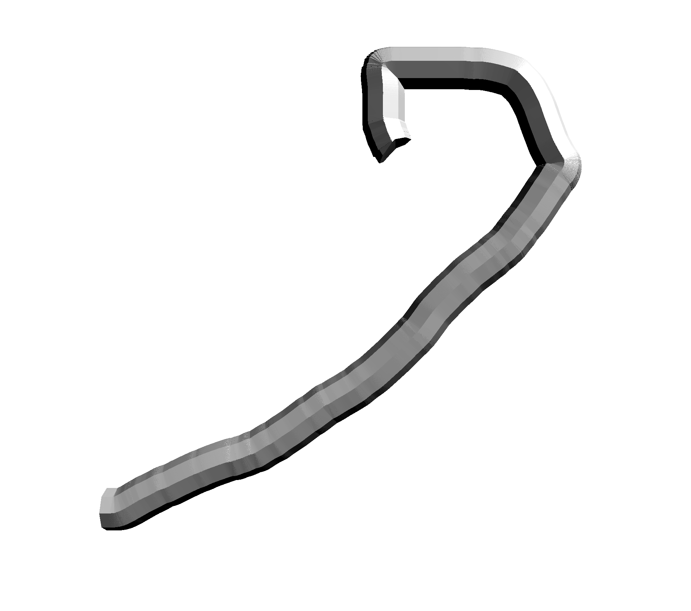

# Extruded Shape Synth

- Lecturer: Mick Grierson
- Student: Daan Rongen
- Unit: Advanced Creative Coding
- Univeristy: Univerity of Arts London (UAL)
- Assignment: Final Project (Creative Work)

## Initial Approach and Issues

Initially, I figured that creating a custom three-dimensional shape could be achieved by assigning two vectors and a shape to a geometric function. For instance, a `mousePos1(x, y, z)` and a `mousePos2(x, y, z)` and a circle shape as written below:

```JavaScript
let circle = new THREE.Shape()
  circle.moveTo(0, 0).absarc(0, 0, r, 0, Math.PI * 2, false)

```

The function would then draw the two-dimensional shape positioned along the centre of the vector. Then, a series of vertices are drawn in three-dimensional space around the two-dimensional shape based on a variable number of segments. This same method would be applied on the second mouse-position, drawing two sets of vertices in three-dimensional space, as the image below implies.


The next step would be to draw faces from these vertices. Each vertex of the first shape would be connected to vertices of the second shape to create triangular faces in order to complete the the three-dimensional shape (similar to a cylinder or hexagonal prism). Every time a new mouse-position comes in (by clicking the next point), this method would repeat but with the last shape placed, iteratively extending the mesh.


However, this approach was not successful. I took a new approach in which I made Three.js do this part of mathematics for me. This approach uses an `ExtrudeBufferGeometry` with a `CatmullRomCurve` to create a custom `extrudePath`.

## Final Approach

An event-listener is added to `canvas` which pushes the cursors `(x, y, z)` positions to an array, this draws a line from position to position, creating the effect of a freehand drawing. To make it more playful, `maximilian` is used to create oscillators. The oscillator's takes a frequency which is relative to the `mouse.x` and a modulator-frequency that is relative to `mouse.y`.

When the cursor is released `drawShape()` is called, which draws a 2D circle and creates a geometry that extrudes this shape along the line-path. This creates the custom geometric shape I intended to draw in the first place.

```JavaScript
let circle = new THREE.Shape()
circle.moveTo(0, 0).absarc(0, 0, r, 0, Math.PI * 2, false)

let path = new THREE.CatmullRomCurve3(points)
let step = path.points.length

let geometry = new THREE.ExtrudeBufferGeometry(circle, {
  extrudePath: path,
  curveSegments: s,
  steps: step,
})
```



The `material` gets assigned a random colour and is added to the scene, and the `maxiSynth()` gets assigned an array of `tones` that is filled with a series of random frequencies that indicate the completion of the geometric shape. When `drawShape()` is finished, both frequencies are set to `0`, muting the oscillators. The lines that were added to the scene using the `drawLine()` method are removed.

## Finished Product

View the finished work [here](https://daanrongen.github.io/ual-advanced-creative-coding/)


